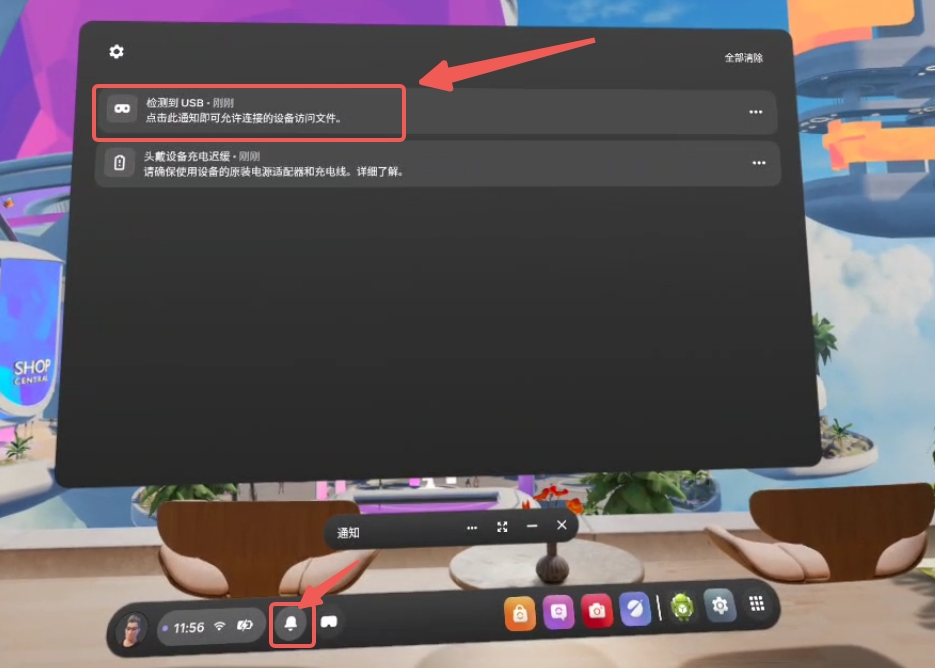
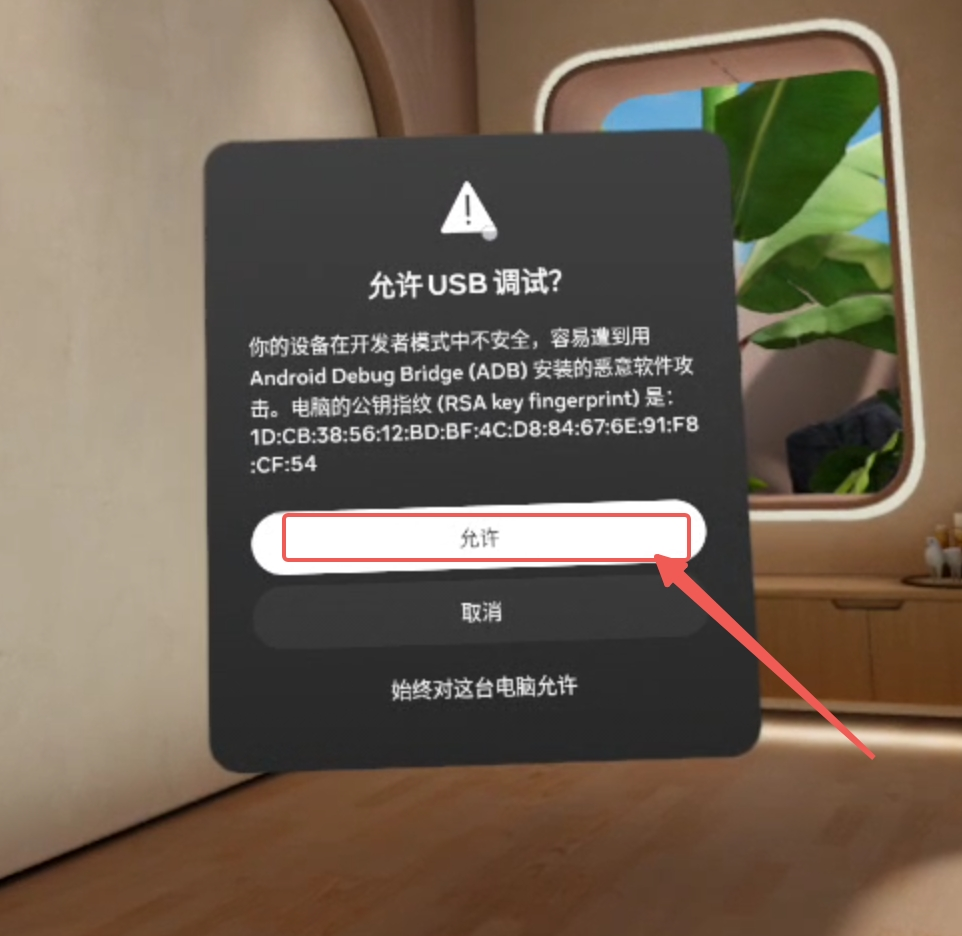
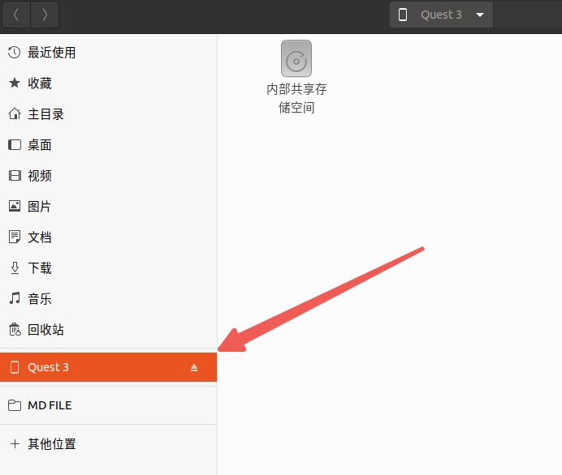

<div align="center">
  <h1 align="center"> quest teleop piper </h1>
  <h3 align="center"> Agilex Robotics </h3>
  <p align="center">
    <a href="README.md"> English </a> | <a>中文</a> 
  </p>
</div>


## 介绍

该仓库实现了使用 meta quest2/3 VR 套装对 piper 机械臂进行遥操作。

### 准备工作 

**一、安装依赖**

```bash
sudo apt install android-tools-adb

conda create -n vt python=3.9

conda activate vt

conda install pinocchio==3.2.0 casadi==3.6.7 -c conda-forge

pip install meshcat rospkg pyyaml pure-python-adb piper-sdk
```

**二、开启开发者模式（必须步骤，否则无法安装第三方APK）**

开始前请确认自己 quest 设备中是否有开发者模式，请参考如下步骤查找：

设置 → 高级 → 开发者 → 将 "启用开发者设置" 打开。

如果有，则跳过此步。

如果没有开发者选项，则参考下面步骤进行激活。

1、注册Meta开发者账号
→ 访问 Meta开发者平台，用Meta账号登录后创建组织（名称随意），绑定信用卡完成验证。

2、在手机App中开启开发者模式
→ 打开手机端 Meta Quest App → 设备设置 → 开发者模式 → 开启开关。

3、在头显中允许未知来源
→ 头显内进入 设置 → 系统 → 开发者选项 → 开启 "未知来源"权限。

**三、设置头显休眠时长**

需要将休眠时长设置最大，以免头显息屏导致无法输出位姿数据。

→ 头显内进入 设置 → 常规 → 电源 → 将"显示屏关闭时间" 调成 4 小时。

四、在头显中安装 APK 文件 2 种方法（有网络与无网络）

这里的有网络是指：国内用户需全程使用**稳定代理环境**（路由器代理/UU加速器/魔法热点），否则无法激活设备或访问Meta服务。

1、无网络环境（推荐）

- 建立连接：开启开发者模式后，用数据线连接Quest与电脑 → Quest弹出"允许USB调试"提示 → 授权后建立通道
- 命令行输入：

```bash
adb install 路径/teleop-debug.apk
```

等待一段时间后，终端输出 Success 即安装成功。

2、有稳定代理环境

- 在quest上安装`teleop-debug.apk`文件，文件在`questVR_ws/src/oculus_reader/APK`目录下。

  - [步骤1] 到meta商店安装Mobile VR Station 应用(联网)

  - [步骤2] 将 quest 与 pc 相连，开启 USB调试，在 pc 上显示新设备接入后，把要上述 apk 文件下载并复制到 quest的 Dowanload 目录里面

  - [步骤3] 开启Mobile VR Station => Configuration Wizard => Show All Options => Configuration Scoped Storage => Step1: Request Access => 选择根目录Dowanload 里面刚刚步骤2放的apk 点击类似放大的按钮会弹出一个窗口，在弹出的窗口里点击安装

3、将代码克隆下来并编译：

```bash
git clone git@github.com:agilexrobotics/questVR_ws.git

cd questVR_ws 

catkin_make
```

我们在 Ubuntu 20.04 上测试了我们的代码，其他操作系统可能需要不同的配置。

有关更多信息，您可以参考 [開始使用 Meta Quest 2](https://www.meta.com/zh-tw/help/quest/articles/getting-started/getting-started-with-quest-2/?srsltid=AfmBOoqvDcwTtPt2P9o6y3qdXT_9zxz4m8yyej4uwLGEXVXv6KAr3QQz) 、[Piper_ros](https://github.com/agilexrobotics/Piper_ros)、[oculus_reader](https://github.com/rail-berkeley/oculus_reader)。

4、进入到 piper_description 功能包下，将 urdf 目录下的 piper_description.urdf 所有 STL 文件的用户名修改成你的用户名，例如：

```xml
<geometry>
        <mesh
          filename="/home/agilex/questVR_ws/src/Piper_ros/src/piper_description/meshes/base_link.STL" />
</geometry>

修改成

<geometry>
        <mesh
          filename="/home/<your name>/questVR_ws/src/Piper_ros/src/piper_description/meshes/base_link.STL" />
</geometry>
```

**四、使用 USB-typeC 线将电脑与 VR 设备连接**

ps:默认是使用有线连接，因为有线连接能保证数据传输的速率以及做到低延迟，如果有无线连接的需求，点击跳转至[无线连接](#无线连接)查看。

1、使用 USB3.0 线束，将 VR 与 PC 相连。

2、然后使用vr头显点击屏幕左下角小铃铛图标，此时会看到“检测到USB”。



3、使用手柄点击一下(右手或左手手柄前侧扳机键)消息通知，此时会弹出“允许 USB 调试？”的窗口。点击“允许”即可建立连接。



4、如果工控机端出现如下设备，则说明可以运行程序。




ps:如若vr重新开关机，这一步为必须重新连接。


### 代码架构说明

oculus_reader，该存储库提供了从 Quest 设备读取位置和按下按钮的工具。

以VR眼镜作为基站，将手柄的与基站的TF关系传输给机械臂。

```bash
├── APK    #apk文件
│   ├── alvr_client_android.apk
│   └── teleop-debug.apk
├── CMakeLists.txt
├── config
│   └── oculus_reader.rviz
├── launch	#启动文件
│   ├── teleop_double_piper.launch
│   └── teleop_single_piper.launch
├── package.xml
└── scripts
    ├── buttons_parser.py
    ├── FPS_counter.py
    ├── install.py
    ├── oculus_reader.py
    ├── piper_control.py		#机械臂控制接口
    ├── teleop_double_piper.py	#遥操作双臂代码
    ├── teleop_single_piper.py	#遥操作单臂代码
    └── tools.py
```

## 软件启动

1、机械臂使能

**单piper使能**：

将机械臂的can线接入电脑

然后执行：

```bash
cd ~/questVR_ws/src/Piper_ros

bash can_activate.sh can0 1000000
```

**左右双piper使能**：


先将左机械臂的can线接入电脑

然后执行：

```bash
cd ~/questVR_ws/src/Piper_ros

bash find_all_can_port.sh 
```

终端会出现左机械臂的端口号，接着将右机械臂的can线接入电脑

再次执行：

```bash
bash find_all_can_port.sh 
```

终端会出现左机械臂的端口号。

将这左右两个端口号复制到 can_config.sh 文件的 111 和 112 行，如下所示：

```bash
# 预定义的 USB 端口、目标接口名称及其比特率（在多个 CAN 模块时使用）
if [ "$EXPECTED_CAN_COUNT" -ne 1 ]; then
    declare -A USB_PORTS 
    USB_PORTS["1-8.1:1.0"]="left_piper:1000000"  #左机械臂
    USB_PORTS["1-8.2:1.0"]="right_piper:1000000" #右机械臂
fi
```

保存完毕后，激活左右机械臂使能脚本：

```bash
cd ~/questVR_ws/src/Piper_ros

bash can_config.sh 
```


2、启动遥操机械臂

```bash
source /home/agilex/questVR_ws/devel/setup.bash

conda activate vt

roslaunch oculus_reader teleop_single_piper.launch    # 单臂遥操

or

roslaunch oculus_reader teleop_double_piper.launch    # 双臂遥操
```

在启动遥操代码时出现该错误时：

```bash
Device not found. Make sure that device is running and is connected over USB
Run `adb devices` to verify that the device is visible.
```

说明了VR头盔未开启调试模式，开启调试模式方法步骤如下：

1. 使用 USB-C 线将VR头盔连接到计算机，然后佩戴该设备。

2. 当在通知中出现“检测到USB”，点击一下该通知。

   

3. 第一次开启程序，会出现上面的报错。

4. 当设备上出现“允许 USB 调试？”窗口时，点击**“允许”**。

   

5. 关掉程序，再次运行。


## 操作说明

> 注意⚠️：
>
> - 请一定要确保VR屏幕保持常亮，否则TF会乱飘导致遥操作机械臂乱飞，我们建议在VR眼镜里面拿东西遮住感应器，使其保持常亮状态。
> - 开启程序后，请一定要确保手柄在VR视野里以及rviz里面的坐标稳定不会乱飘，然后按住按键“A”||“X”使机械臂复位，复位后才可进行遥操做，否则机械臂也会乱飞。
> - 在遥操 piper 启动后，请注意观察网页端的机械臂是否乱飘，

- 遥操单臂使用右手手柄，开始遥操前确保机械臂回到初始姿态，按住按键 “A” 能使机械臂回到初始位置，长按按键 “B” 为遥操机械臂，松开为停止控制。遥操双臂同理。  

- 为了操作的人身安全以及减少对机械臂的损害，在遥操结束后，请确保机械臂回到初始位置附件再按下“A”||“X”键复位。


## 手柄按键说明

按键值 button 可以通过下行代码获取到

```bash
transformations, buttons = oculus_reader.get_transformations_and_buttons()
```

以下数据是使用 `print("buttons:", buttons)` 打印 button 值的一帧数据：

```python
buttons: {'A': False, 'B': False, 'RThU': True, 'RJ': False, 'RG': False, 'RTr': False, 'X': False, 'Y': False, 'LThU': True, 'LJ': False, 'LG': False, 'LTr': False, 'leftJS': (0.0, 0.0), 'leftTrig': (0.0,), 'leftGrip': (0.0,), 'rightJS': (0.0, 0.0), 'rightTrig': (0.0,), 'rightGrip': (0.0,)}
```

### 按钮状态 (Booleans: `True`/`False`)

这部分的值是布尔类型（`True` 或 `False`），`False` 表示按钮未被按下，`True` 表示按钮被按下。

- **`'A': False`**: 右手柄的 "A" 按钮未被按下。
- **`'B': False`**: 右手柄的 "B" 按钮未被按下。
- **`'X': False`**: 左手柄的 "X" 按钮未被按下。
- **`'Y': False`**: 左手柄的 "Y" 按钮未被按下。
- **`'RThU': True`**: **R**ight **Th**umbstick **U**p。表示你的右拇指正放在右摇杆的电容传感器上，但并没有按下摇杆。
- **`'LThU': True`**: **L**eft **Th**umbstick **U**p。表示你的左拇指正放在左摇杆的电容传感器上，但并没有按下摇杆。
- **`'RJ': False`**: **R**ight **J**oystick (or Thumbstick) Click。右摇杆（拇指摇杆）没有被按下。
- **`'LJ': False`**: **L**eft **J**oystick (or Thumbstick) Click。左摇杆（拇指摇杆）没有被按下。
- **`'RG': False`**: **R**ight **G**rip。右侧握把键（中指按的键）没有被按下。
- **`'LG': False`**: **L**eft **G**rip。左侧握把键（中指按的键）没有被按下。
- **`'RTr': False`**: **R**ight **Tr**igger。右侧扳机键（食指按的键）没有被完全按下（通常有一个阈值来判断是否为 `True`）。
- **`'LTr': False`**: **L**eft **Tr**igger。左侧扳机键（食指按的键）没有被完全按下。

### 摇杆和传感器模拟值 (Tuples with Floats)

这部分的值是浮点数元组，表示摇杆的偏离程度或扳机/握把的按压深度，范围通常在 0.0 到 1.0 之间，或 -1.0 到 1.0 之间。

- **`'leftJS': (0.0, 0.0)`**: 左摇杆 (Left Joystick) 的状态。这是一个包含两个浮点数的元组 `(x, y)`，分别代表水平和垂直方向的偏离。`(0.0, 0.0)` 表示摇杆处于中心位置，没有被推动。
- **`'rightJS': (0.0, 0.0)`**: 右摇杆 (Right Joystick) 的状态。同上，`(0.0, 0.0)` 表示摇杆处于中心位置。
- **`'leftTrig': (0.0,)`**: 左扳机键 (Left Trigger) 的按压深度。`0.0` 表示完全松开，`1.0` 表示完全按下。
- **`'rightTrig': (0.0,)`**: 右扳机键 (Right Trigger) 的按压深度。`0.0` 表示完全松开。
- **`'leftGrip': (0.0,)`**: 左握把键 (Left Grip) 的按压深度。`0.0` 表示完全松开，`1.0` 表示完全按下。
- **`'rightGrip': (0.0,)`**: 右握把键 (Right Grip) 的按压深度。`0.0` 表示完全松开。


## 无线连接

### 第一阶段：准备工作（必须处于同一局域网）

- **同一 Wi-Fi**：确保你的电脑和 Quest 连接在同一个路由器的 Wi-Fi 下。
- **5GHz 优先**：为了降低延迟和数据丢包，强烈建议连接 **5G 频段** 的 Wi-Fi，而不是 2.4G。
- **电脑端工具**：确保电脑已安装 `adb` 工具。

### 第二阶段：首次连接与激活无线模式

Quest 在重启后默认会关闭无线调试端口，因此**每次 Quest 彻底关机重启后**，你通常需要执行一次以下步骤：

1. **USB 线连接**：用 USB 线将 Quest 连接到电脑。

2. **授权设备**：戴上头显，如果弹出“允许 USB 调试？”，勾选“允许”并确认。


3. **开启监听端口**：在电脑终端输入以下命令：

```bash
adb tcpip 5555
```

如果弹出“允许 USB 调试？”，勾选“允许”并确认。

*如果成功，终端会返回：`restarting in TCP mode port: 5555`。*

4. **拔掉 USB 线**：现在你可以断开物理连线了。

### 第三阶段：获取 IP 并建立无线握手

1. **查询 Quest IP 地址**：

   - **方法 A (头显内)**：设置 -> Wi-Fi -> 点击已连接的 Wi-Fi -> 详情 -> 记录下头显的 IP 地址。

   - **方法 B (电脑命令行)**：

     ```bash
     adb shell ip route
     ```

     *查看 `wlan0` 对应的 `src` 后面的数字。*

2. **手动建立无线连接**（这一步能确保 Python 脚本顺利运行）：

   ```bash
   adb connect <你的Quest_IP>:5555
   # 示例：adb connect 192.168.1.101:5555
   ```

   *看到 `connected to ...` 说明无线链路已打通。*

### 第四阶段：Python 代码调用

在你的代码中，直接填入该 IP 即可：

```Python
from oculus_reader import OculusReader

# 确保这里的 IP 与上面 adb connect 的 IP 完全一致
self.oculus_reader = OculusReader(ip_address='192.168.1.101') 
```

### 第五阶段：运行程序

`oculus_reader` 依赖于安装在 Quest 里的一个 APK 文件来抓取传感器数据。

1. **确保已安装 APK**
2. **启动应用程序：
   - 参考[软件启动](#软件启动)开启动程序。
   - 程序启动后可能会弹出“允许 USB 调试”，勾选“允许”并确认。
